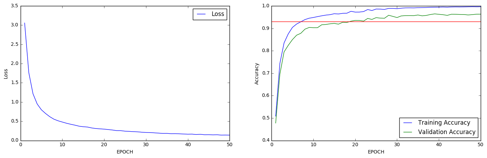

#**Traffic Sign Recognition** 

---

**Build a Traffic Sign Recognition Project**

The goals / steps of this project are the following:

* Load the [German Traffic Sign Dataset](http://benchmark.ini.rub.de/?section=gtsrb&subsection=dataset)
* Explore, summarize and visualize the data set
* Design, train and test a model deep learning architecture
* Use the model to make predictions on new images
* Analyze the softmax probabilities of the new images
* Summarize the results with a written report

[//]: # (Image References)
[image1]: ./examples/visualization.jpg "Visualization"
[image2]: ./examples/grayscale.jpg "Grayscaling"
[image3]: ./examples/random_noise.jpg "Random Noise"
[image4]: ./examples/placeholder.png "Traffic Sign 1"
[image5]: ./examples/placeholder.png "Traffic Sign 2"
[image6]: ./examples/placeholder.png "Traffic Sign 3"
[image7]: ./examples/placeholder.png "Traffic Sign 4"
[image8]: ./examples/placeholder.png "Traffic Sign 5"

**This written report covers the [rubric points](https://review.udacity.com/#!/rubrics/481/view) individually and describes how I addressed each point in my implementation.** You may want to follow along using the [iPython notebook](https://github.com/anandman/CarND-Traffic-Sign-Classifier-Project/blob/master/Traffic_Sign_Classifier.ipynb) that was used to generate the data in this writeup. If you wish to dig in deeper than this writeup, you can follow the instructions in the [Setup](#setup) section at the bottom of this writeup to access and run the notebook yourself.

---
###Data Set Exploration

####Dataset Summary

The code for this step is contained in the 2nd code cell of the iPython notebook.  

I used the NumPy library to calculate summary statistics of the traffic
signs data set:

* The size of the training set is 34799 examples.
* The size of the validation set is 4410 examples.
* The size of the test set is 12630 examples.
* The shape of a traffic sign image is (32, 32, 3) or 32x32 pixels in RGB color.
* The number of unique classes/labels in the data set is 43.

####Exploratory Visualization

The code for this step is contained in the 3rd and 4th code cells of the iPython notebook.  

First is a visualization of a random sample of each of the 43 sign classes. You will notice from the sample pictures that some of the signs are very dark and difficult to read. We'll fix those up later.

Second up is a bar chart showing a histogram of the training samples per class. You'll notice that some of the sign classes have a lot of sample pictures while others have very few.

###Design and Test a Model Architecture

####Preprocessing

The code for this step is contained in the 5th code cell of the iPython notebook.

I experimented with a few preprocessing techniques but settled on three in the end.

First, I converted the images to grayscale. The color information was not usesful in my experiments and there was a per-epoch runtime speedup of about 1.5x using grayscale over color images. More importantly, there was a mild improvement in accuracy of the validation training set when using the grayscale images.

Second, I equalized the histograms using the CLAHE algorithm built into OpenCV. This fixed the problem of some of the signs being too dark.

Finally, I normalized the image data to -1 <= pixel <= 1 rather than 0 <= pixel <=255. Reducing the range of values should, in theory, make it easier for the network to train faster, especially with a smaller learning rate.

If I were to go further, I would augment this data set with perturbed images, especially for those classes which were underrepresented in the [histogram](#histogram) above. Perturbation could include randomly rotating, shifting, scaling, warping/projecting, blurring, adding noise to, or adjusting the gamma of the image.

Here is a random sample of all 43 classes after the three preprocessing techniques above were applied.

####Model Architecture

The code for my model is located in the 6th cell of the iPython notebook. 

I used an almost vanilla LeNet-5 model, with the only difference being adding dropout stages to the fully connected outputs and expanding the classification stage to 43 outputs.

Here is a picture of the original LeNet-5:

And here is a tabular description of the model I used:

| Layer         		|     Description	        					| 
|:---------------------:|:---------------------------------------------:| 
| Input         		| 32x32x1 grayscale image   					| 
| Convolution 5x5     	| 1x1 stride, valid padding, outputs 28x28x6 	|
| RELU					|												|
| Max pooling	      	| 2x2 stride, valid padding, outputs 14x14x6	|
| Convolution 5x5     	| 1x1 stride, valid padding, outputs 10x10x16 	|
| RELU					|												|
| Max pooling	      	| 2x2 stride, valid padding, outputs 5x5x16		|
| Flatten				| outputs 400  									|
| Fully connected		| outputs 120  									|
| RELU					| + dropout of 50%								|
| Fully connected		| outputs 84  									|
| RELU					| + dropout of 50%								|
| Fully connected		| outputs 43  									|

####Model Training

The code for training the model is located in the 8th and 9th cells of the iPython notebook, with the hyper-paramters used in the 7th cell.

To train the model, I used a learning rate of 0.0009 which is much higher than the default rate of 0.0001 that was used in the LeNet lab for MNIST recognition. This allowed it to train much faster while not overshooting too badly. In the future, I would consider starting with a large number and adding decay to lower it over time as the network starts to learn. The batch size was unchanged from MNIST at 128 though slightly smaller values like 100 were also good. Finally, I increased the number of epochs to 30 since there are more parameters in this model and we need more time to learn.

####Solution Approach

The code for calculating the accuracy of the model is located in the 11th cell of the iPython notebook.

My final model results were:
* training set accuracy of 99.8%
* validation set accuracy of 96.5%
* test set accuracy of 94.7%

This project was achievable with a relatively simple modification of the LeNet-5 network architecture, as mentioned [above](#model). I iterated through various combinations of [pre-processing](#preprocessing) to find a combination that worked well and seemed logical. As you can see in the charts below, the loss function and the training and validation accuracy increased nicely without a lot of overfitting. If I were to continue further experiments, I would consider the architecture choices mentioned in the [paper by Sermanet & LeCun](http://yann.lecun.com/exdb/publis/pdf/sermanet-ijcnn-11.pdf) and other similar research.

###Test a Model on New Images

####Acquiring New Images

Here are five German traffic signs that I found on the web:

The first three images should be easy to classify but the 4th and 5th are skewed so may cause difficulty for the classifier, especially since I didn't augment the data with such perturbations. I load and show the images in the 12th cell if the iPython notebook.

####Performance on New Images

The code for making predictions on my final model is located in the 13th cell of the iPython notebook.

Here are the results of the prediction:

| Image			        |     Prediction	      	| 
|:---------------------:|:-------------------------:| 
| Speed limit (20mk/h)  | Speed limit (20km/h)		| 
| General caution 		| General caution			|
| Double curve			| Double curve				|
| Keep right      		| Keep right				|
| Roundabout mandatory	| Speed limit (100km/h)   	|

The model was able to correctly guess 4 of the 5 traffic signs, which gives an accuracy of 80%. This compares favorably to the accuracy on the test set. The model correctly predicted the first three signs as expected as well as the 4th. It however, got the last one incorrect.

####Model Certainty - Softmax Probabilities

The code for calculating the top 5 probabilities on my final model is located in the 14th cell of the iPython notebook.

The first four images are predicted correctly at 100%. For the fifth image, the model is tentatively sure that this is a speed limit (100km/h) sign (probability of 49%), but obviously is wrong. The correct classification is "Roundabout mandatory" with a probability of only 4%. This is very likely because of the extreme angle of the image.

---
### Setup
1. Clone the project and start the notebook.

		git clone https://github.com/anandman/CarND-Traffic-Sign-Classifier-Project
		cd CarND-Traffic-Sign-Classifier-Project
2. [Download the dataset](https://d17h27t6h515a5.cloudfront.net/topher/2017/February/5898cd6f_traffic-signs-data/traffic-signs-data.zip) and unzip the files into a directory named `traffic-signs-data`. This is a pickled dataset in which we've already resized the images to 32x32.
3. Make sure you have an environment setup that includes Jupyter, Python 3.5+, NumPy, SciPy, MatPlotLib, Pandas, OpenCV, and TensorFlow. You can get a complete setup if you follow [these directions](https://github.com/udacity/CarND-Term1-Starter-Kit).
4. Launch Jupyter to read the iPython notebook:

		jupyter notebook Traffic_Sign_Classifier.ipynb
5. Open up the iPython notebook in your browser using the instructions Jupyter gave you and run all the cells from the Cell menu.